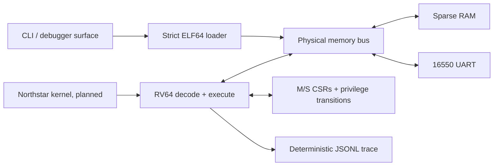

# Northstar64

[](https://github.com/StaryMoon/Northstar64/actions/workflows/ci.yml)
[](https://github.com/StaryMoon/Northstar64/actions/workflows/codeql.yml)
[](LICENSE)

**A deterministic RV64 machine and Unix-like kernel laboratory, built from first principles.**

Northstar64 is a long-horizon systems project: a dependency-free C++20 RISC-V machine today,
with a small Unix-like kernel growing on top of it. The goal is to make architecture decisions,
faults, and execution evidence inspectable rather than hiding them behind a large framework.

```text
RV64 ELF  ->  strict loader  ->  sparse physical bus  ->  decode/execute  ->  UART
                                     |                         |
                                     +-- MMIO contracts        +-- exact traps + CSRs
                                                               |
                                                               +-- stable JSONL trace
```

## What Works

- RV64I integer instructions, including the RV64 word operations
- `Zicsr` CSR instructions with explicit M/S/U privilege and address-derived access checks
- precise delegated synchronous trap entry through direct `stvec`/`mtvec`, plus `SRET`/`MRET`
- an independently testable Sv39 walker with typed faults, superpages, and permission checks
- `Zifencei` decode/execution semantics for a single-hart interpreter
- precise illegal-instruction, fetch, load, store, alignment, breakpoint, and `ecall` traps
- a non-overlapping memory bus, sparse zero-filled RAM, and a byte-access 16550 UART model
- strict, bounds-checked ELF64 RISC-V `ET_EXEC` loading with transactional range validation
- deterministic instruction traces with first-divergence comparison
- a scriptable CLI for running, inspecting, decoding, and comparing executions
- unit, sanitizer, macOS/Linux compiler-matrix, and real cross-compiled RV64I guest tests

## Build

Northstar64 has no runtime dependencies. A C++20 compiler is sufficient for the host machine.

```bash
git clone https://github.com/StaryMoon/Northstar64.git
cd Northstar64
make check
```

With CMake and Ninja:

```bash
cmake --preset dev
cmake --build --preset dev
ctest --preset dev
```

The host emulator builds on macOS and Linux. Building the integration guests additionally needs
`riscv64-unknown-elf-gcc`; CI exercises that path on every pull request.

## Run A Guest

```bash
make -C tests/integration
./.build/northstar64 inspect build/guest/hello.elf
./.build/northstar64 run build/guest/hello.elf \
  --max-steps 1000 \
  --trace hello.trace.jsonl
```

The integration guest writes through the emulated UART, verifies a RAM round trip, and stops at an
architectural breakpoint. Running it twice produces byte-identical traces:

```bash
./.build/northstar64 verify-trace first.trace.jsonl second.trace.jsonl
# traces are byte-for-byte identical
```

Other useful commands:

```bash
./.build/northstar64 decode 0x02a00093
# addi x1, x0, 42

./.build/northstar64 version
```

## Execution Contract

Every attempted step distinguishes three states:

1. **Attempted**: the clock advances and an instruction fetch is attempted.
2. **Retired**: decode and execution complete without a synchronous exception.
3. **Trapped**: the faulting PC and value are recorded in the selected supervisor or machine trap
   bank; the instruction does not retire.

The JSONL trace records the PC, privilege before execution, raw instruction, disassembly, next PC,
privilege after execution, register write, memory write, and trap outcome in a stable field order.
Wall-clock time is deliberately absent, so equal inputs produce equal evidence.

## Architecture



The core library does not know about CLI parsing or terminal I/O. Devices implement explicit
addressed read/write contracts; CPU execution sees only the bus. This boundary is where future
CLINT, PLIC, virtio, Sv39 translation, and differential backends attach.

Read [the architecture](docs/architecture.md), [the supported ISA contract](docs/isa-support.md),
and [the determinism model](docs/determinism.md) before extending the machine.

## Current Boundary

Northstar64 is not yet a complete RISC-V platform and does not currently boot Linux. The `v0.1.0`
release is a machine-mode baseline. Current `main` adds explicit M/S/U state, supervisor CSRs,
delegated synchronous traps, precise return transitions, and a standalone Sv39 reference walker.
CPU fetch/load/store paths are not connected to that walker yet, so the machine still executes with
physical addresses. It also has no asynchronous interrupts, floating point, atomics, compressed
instructions, or block device. It has not yet passed the upstream `riscv-arch-test` suite.

Those are roadmap items, not implied features. See [ROADMAP.md](ROADMAP.md) for the order in which
they will be added and the evidence required for each milestone.

## Engineering Principles

- **Failure paths are first-class.** Malformed ELF files and invalid guest accesses return typed
  errors or architectural traps.
- **Determinism is observable.** A run can be replayed and compared at its first divergent step.
- **Interfaces precede devices.** New hardware enters through the bus contract, not CPU special
  cases.
- **Claims follow tests.** README support means a unit test plus a cross-toolchain integration path.
- **The kernel and machine stay separable.** The kernel must be portable to QEMU `virt`; the
  emulator must run freestanding guests that are not the Northstar kernel.

## Contributing

The project is early enough for design changes, but architecture changes should begin with an issue
or ADR. See [CONTRIBUTING.md](CONTRIBUTING.md) for the local checks and review contract.

## License

Northstar64 is available under the [MIT License](LICENSE).
